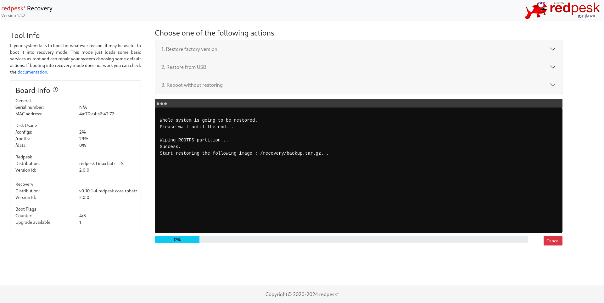

# redpesk OS recovery tools binding

## How it works

Restoring a redpesk OS partition is the goal of this binding:

- from the `/recovery` partition backup called `backup.tar.gz`
- from an USB key with a redpesk image (or others depending on needs)

For that, your embedded system must have to boot on the redpesk `/recovery` partition. It contains an initramfs image which is a redpesk OS minimal image (with DHCP/Ethernet features, redpesk OS application framework). The `recovery-tools-binding` offers an API server running through a web socket (default port: **8080**). It is accessible by using [afb-client]() or the web interface:



## Structure

This binding is composed by some scripts useable from a web application. Its structure is quite simple to understand:

```
.
├── conf
│   └── spawn-recovery-config.json -> launching configuration
├── e2e -> Angular web-app tests
├── scripts
│   ├── check-update.sh -> to enable recovery mode
│   ├── get_board_data.sh -> for recovery information
│   └── restore_backup.sh -> to restore redpesk OS backup
└── src -> sources to build Angular web-application
```

## Packaging

When you install the `recovery-tools-binding` package, the scripts & Angular web application are installed in `/usr/redpesk/recovery` directory. A `systemd` service unit is used to launch the recovery web application within a binder in addition of [spawn-binding]() permissions.

```
[root@localhost ~]# rpm -ql recovery-tools-binding
/usr/lib/systemd/system/redpesk-recovery-app.service
/usr/redpesk/recovery
/usr/redpesk/recovery/conf
/usr/redpesk/recovery/conf/spawn-recovery-config.json
/usr/redpesk/recovery/scripts
/usr/redpesk/recovery/scripts/check-update.sh
/usr/redpesk/recovery/scripts/get_board_data.sh
/usr/redpesk/recovery/scripts/restore_backup.sh
/usr/redpesk/recovery/webapp
/usr/redpesk/recovery/webapp/3rdpartylicenses.txt
/usr/redpesk/recovery/webapp/4.cb4a30ff549f8c5aa602.js
/usr/redpesk/recovery/webapp/assets
/usr/redpesk/recovery/webapp/assets/404.png
/usr/redpesk/recovery/webapp/assets/redpesk-fish-name.png
/usr/redpesk/recovery/webapp/favicon.ico
/usr/redpesk/recovery/webapp/index.html
/usr/redpesk/recovery/webapp/main.5d488b80c06b87ffaaaf.js
/usr/redpesk/recovery/webapp/polyfills.87832c41e2a32f1e0665.js
/usr/redpesk/recovery/webapp/runtime.f61e48c59dc3145a4554.js
/usr/redpesk/recovery/webapp/styles.dbc4a2089f8cfa9f92a4.css
```

## Recovery mode details

Please refer to the [documentation guide]() for more information about the recovery mode and binding usages.