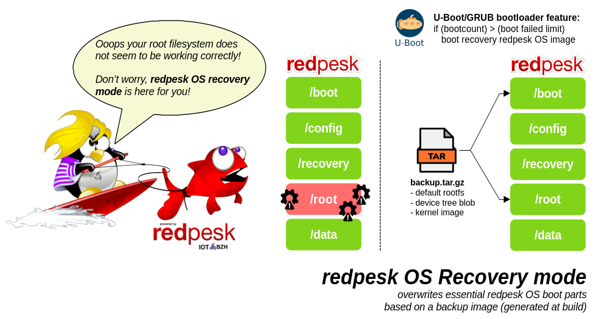

# Main redpesk recovery features

## General principles

During industrial use in an embedded context, you may encounter a corrupted root filesystem, a broken Linux kernel or issues with necessary `systemd` base services.

If your system fails to boot for any reason, it may be useful to boot it into recovery mode. 

This mode only loads basic services as root and can repair your system choosing some default actions.

On redpesk OS, this feature enables the recovery of the root file system in different ways:
- by a default image which is stored on the `/recovery` partition (eMMC/SD card)
- by a USB key (the `backup.tar.gz` image must be stored on the USB key's root)

> **_Note:_** The USB key might be changed to another device depending on your needs.

A Linux kernel watchdog could be implemented to avoid booting all the time in the recovery mode.

## Restoring essential boot parts

### redpesk OS `/recovery` partition

On a default redpesk OS image (please refer [here]() for partitioning details), the `/recovery` partition contains these items:

```
/run/media/iotbzh/recovery
|-- backup.tar.gz -> tarball copy of the rootfs (~250Mo for recovery)
|-- imx8mn-compact-5.4.47-24.solidrun.edge.gateways.bsp.rpbatz.aarch64.dtb -> dtb
|-- imx8mn-compact.dtb -> dtb (symbolic link)
|-- initramfs.img -> initramfs made by dracut
`-- recovery.img -> kernel Image
```

### Restoration mechanism

As shown in the following illustration, the recovery mode restores the kernel image, the device tree blob and the rootfs archive when activated. 



These components have been generated during the image build. It is specified by `dracut-redpesk-recovery`.

This [package](https://download.redpesk.bzh/redpesk-lts/batz-2.0-update/packages/middleware/aarch64/os/Packages/d/) contains **dracut** configuration recipes to build the initramfs dedicated for recovery mode booting. More details [in this section]().

### Initramfs creation

To create the initramfs dedicated for redpesk OS, **dracut** uses configuration files. They are installed in the `/etc/dracut.conf.d/redpesk/` directory thanks to [features/initramfs.ks](https://github.com/redpesk-infra/rp-kickstarts/blob/batz-2.0-update/features/initramfs.ks). 

There are dracut modules too which are available in `/usr/lib/dracut/modules.d/99recovery`.

In output, an image must be converted to U-Boot ramdisk in order to be readable by U-Boot.

```bash
#Create and correct dracut initramfs file to be loaded into U-Boot
#This initramfs will be used for recovery mode and will then but installed into recovery partition mounted in /recovery

%packages
dracut-redpesk-recovery
%end


%post --erroronfail --log /tmp/post-initramfs.log
dracut -f --no-kernel --confdir="/etc/dracut.conf.d/redpesk/" /tmp/initramfs.img

if [[ `rpm -E %{_arch}` == "aarch64" ]]; then
	mkimage -A arm64 -O linux -T ramdisk -C gzip -d /tmp/initramfs.img /recovery/initramfs.img
	rm -f /tmp/initramfs.img
else
	mv /tmp/initramfs.img /recovery/initramfs.img
	#Re-generate grub2 entries with recovery initramfs
	grub2-mkconfig -o /boot/efi/EFI/redpesk/grub.cfg
fi

#Remove pkg only installed for initramfs generating
dnf remove -y dracut-redpesk-recovery

%end
```

### backup.tar.gz creation

The redpesk OS backup is just an archive of the root filesystem.
It is created by the [features/factory_backup.ks](https://github.com/redpesk-infra/rp-kickstarts/blob/batz-2.0-update/features/factory_backup.ks) kickstart.

```
tar -cvpzf $dir/backup.tar.gz \
	--exclude=./boot/firmware/* \
	--exclude=./boot/efi/* \
	--exclude=./recovery/* \
	--exclude=./data/* \
	--exclude=./config/* \
	--exclude=./dev/* \
	--exclude=./proc/* \
	--exclude=./run/* \
	--exclude=./sys/* \
	.
```

It will override the `/root` partition during the restoration.

### kernel & dtb copy

At each redpesk OS image build, the kernel and the dtb are copied to the `recovery` partition. It is done by the [features/recovery.ks](https://github.com/redpesk-infra/rp-kickstarts/blob/batz-2.0-update/features/recovery.ks) kickstart.

```
%post --erroronfail --log /tmp/post-recovery.log
if [[ `rpm -E %{_arch}` == "aarch64" ]]; then
	cp /boot/Image /recovery/recovery.img
	cp /boot/*.dtb /recovery/
elif [[ `rpm -E %{_arch}` == "x86_64" ]]; then
	cp /boot/vmlinuz*x86_64 /recovery/recovery.img
else
	echo "WARN: recovery not supported for this arch."
fi
sed -i '/recovery/d' /etc/fstab
%end
```

## Recovery from U-Boot (redpesk OS - aarch64)

A [U-Boot feature](https://docs.u-boot.org/en/latest/api/bootcount.html#boot-count-limit) is the boot count limit. 

Enabled by `CONFIG_BOOTCOUNT_LIMIT`, it allows the detection of multiple failed attempts to boot redpesk OS. After a power-on reset, the bootcount variable will be initialized to 1, and each reboot will increment the value by 1.

Typically for redpesk OS, the recovery mode is selected when the bootcount variable is greater than the bootcount limit.

When this is the case, U-Boot doesn't use _bootcmd_ but _altbootcmd_ (such as alternative boot) which goes to the recovery initramfs loading. More details in this example [here]().

## Recovery from GRUB (redpesk OS - x86_64)

For x86 boards, another GRUB entry is created by following this configuration:

```
menuentry "redpesk Recovery mode" {
        insmod part_gpt
        insmod ext2
        set reco='hd0,3'
        linux        ($reco)/recovery.img ro security=smack console=ttyS0,115200 rhgb audit=0
        initrd       ($reco)/initramfs.img
}
```

You have the choice of the boot way during the GRUB boot selection.
