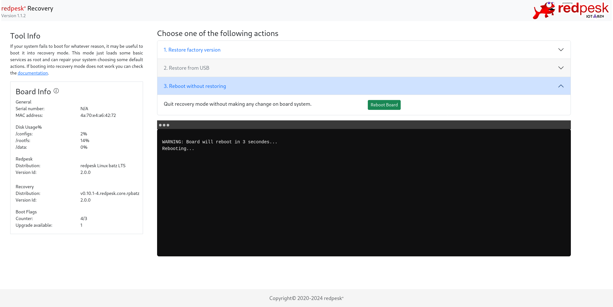

# redpesk OS recovery usages

## Requirements

### recovery-tools-binding

By default, the redpesk OS recovery feature isn't activated so it requires the installation of `recovery-tools-binding-scripts` on your redpesk OS image. This package contains necessary [scripts]() needed for recovery mode activation.

```sh
dnf install recovery-tools-binding-scripts

rpm -ql recovery-tools-binding-scripts
/usr/redpesk/recovery/scripts
/usr/redpesk/recovery/scripts/check-update.sh
/usr/redpesk/recovery/scripts/get_board_data.sh
/usr/redpesk/recovery/scripts/restore_backup.sh
```

It is possible to avoid the `recovery-tools-binding-scripts` installation on your target. More details [here]().

### Example on a supported board

For example, you want to enable the recovery mode on the [SolidRun SolidSense N8 Edge Gateway]() board. Some others packages are required like [spawn-binding]() but they are automatically installed as dependencies with the `recovery-tools-binding` package. So, as explained above, you first need to install `recovery-tools-binding-scripts` on the board:

```
[root@localhost ~]# dnf install recovery-tools-binding-scripts
Updating Subscription Management repositories.
Unable to read consumer identity

This system is not registered with an entitlement server. You can use subscription-manager to register.

Redpesk BSP solidrun-edge-gateways-bsp Update b 117 kB/s | 119 kB     00:01    
RedPesk Middleware batz-2.1 Update - aarch64    274 kB/s | 295 kB     00:01    
RedPesk Baseos batz-2.1 Update - aarch64        1.4 MB/s | 6.5 MB     00:04    
RedPesk Config                                  899  B/s | 903  B     00:01    
Dependencies resolved.
============================================================================================================
 Package                  Arch     Version                                  Repository                  Size
============================================================================================================
Installing:
 recovery-tools-binding-scripts   aarch64  1.0.3-12.redpesk.common.rpbatz   redpesk-middleware-update  421 k
```

## How to enable the recovery mode

Please note that the following process can be adapted to your needs [on demand]().

### Checking recovery environment (optional)

- Get recovery redpesk OS version

```
/usr/redpesk/recovery/scripts/get_board_data.sh --recovery

{"recovery": {
"PRETTY_NAME":"redpesk Linux batz LTS",
"VERSION":"batz LTS",
"VERSION_ID":"2.0.0",
}}
```

- Get U-Boot settings for recovery

```
/usr/redpesk/recovery/scripts/get_board_data.sh --uboot

## Error: "upgrade_available" not defined
{"boot_flags": {
"limit":"3",
"counter":"",
"upgrade_available":"",
}}
```

### Activating recovery mode

You must enable the recovery tools by doing the following action:

```
/usr/redpesk/recovery/scripts/check-update.sh -s=0,1
/usr/redpesk/recovery/scripts/check-update.sh -p

=========================
    BOOT COUNT FLAGS
-------------------------
BOOTLIMIT : 3
BOOTCOUNT : 1/3
UPGRADE   : 1
=========================
```

To understand what it does, the script adds the `upgrade_available` variable to U-Boot's environment by using `fw_setenv` to write to `/var/lib/rp-recovery/uboot-env.config`. Please refer [here]() for more U-Boot details.

It has added the `upgrade_available` variable into the U-Boot's environment config:

```
soc_type=imx8mn
upgrade_available=1
usb_boot=usb start; if usb dev ${devnum}; then devtype=usb; run scan_dev_for_boot_part; fi
vendor=solidrun
```

### Rebooting to recovery mode

The system will automatically go into recovery mode  the third time it boots if you [activate]() the recovery mode. Indeed, the `BOOTCOUNT` variable is increased at each boot by the U-Boot bootloader. The limit to its variable is normally `3` that's why you will go into recovery mode with this value.

```
Normal Boot
Warning: Bootlimit (3) exceeded. Using altbootcmd.
Hit any key to stop autoboot:  0 
switch to partitions #0, OK
mmc1 is current device
Scanning mmc 1:1...
Found U-Boot script /altboot.scr
504 bytes read in 10 ms (48.8 KiB/s)
## Executing script at 44100000
Boot into recovery mode...
37743 bytes read in 17 ms (2.1 MiB/s)
29528576 bytes read in 1743 ms (16.2 MiB/s)
30232962 bytes read in 1267 ms (22.8 MiB/s)
```

Here you are into the recovery mode!

```
pre-mount:/# cat /etc/os-release
NAME="redpesk Linux"
VERSION_ID="2.0.0"
VERSION_CODENAME="batz"
ID="redpesk"
ID_LIKE="rhel fedora centos"
PLATFORM_ID="platform:rpbatz"
ANSI_COLOR="0;31"
CPE_NAME="cpe:/o:redpesk:centos:batz"
HOME_URL="https://redpesk.bzh/"
BUG_REPORT_URL="https://bugs.redpesk.bzh"
redpesk_MANTISBT_PROJECT="redpesk-batz"
redpesk_MANTISBT_PROJECT_VERSION="batz"
ARCH="aarch64"
BUILD_DATE="2024-02-26 06:03:41"
VERSION="batz LTS dracut-057-21.git20230214.baseos.rpbatz"
PRETTY_NAME="redpesk Recovery v0.9.5-5.redpesk.core.rpbatz Linux batz LTS dracut-057-21.git20230214.baseos.rpbatz "
DRACUT_VERSION="057-21.git20230214.baseos.rpbatz"
```

## redpesk OS recovery modes

You can access the `recovery-tools-binding` web interface on the network interface of your board, port **8080**:


### Restoring redpesk OS from factory version

<!-- VAL to complete -->

### Restoring redpesk from USB

<!-- VAL to complete -->

### Reboot without restoring

If you want to reboot without redpesk restoration, click on the third menu item:



## systemd script to deactivate recovery mode

<!-- VAL TODO -->

### Linux kernel watchdog to disable U-Boot's bootcount

As explained, you should use a [watchdog](https://www.kernel.org/doc/html/v5.9/watchdog/watchdog-api.html) or an equivalent mechanism to decrease the recovery's variable for each correct boot (e.g. all systemD services correctly started).

It may call the `check-update.sh` script to remove the `upgrade_available` variable in U-Boot's environment.

Please note that you can write into U-Boot's environment from the Linux userspace by using `fw_setenv` function from the `uboot-tools` package.

## Force the recovery mode from the bootloader

If you want to directly boot to recovery mode for testing purposes, it is possible to avoid a redpesk OS boot or bootcount variable use. For the most of our boards, we boot redpesk OS on aarch64 (ARM64) boards using U-Boot bootscripts and x86_64 (Intel) boards using GRUB entry menu. For recovery mode, the [alternative bootscript]() is used to load the initramfs.

```
load ${devtype} ${devnum}:${distro_bootpart} ${fdt_addr_r} imx8mn-compact.dtb
load ${devtype} ${devnum}:3 ${loadaddr} recovery.img
load ${devtype} ${devnum}:3 ${ramdisk_addr_r} initramfs.img
setenv initrd_size ${filesize}
setenv bootargs console=ttymxc1,115200 rw earlyprintk
booti ${loadaddr} ${ramdisk_addr_r}:${initrd_size} ${fdt_addr_r}
```

So the only thing to do is to execute it (with defined variables) after interrupting U-Boot bootflow:

```
Fastboot: Normal
Normal Boot
Hit any key to stop autoboot:  0 

# variables for altboot.scr
u-boot=> env set devtype mmc
u-boot=> env set devnum 1
u-boot=> env set distro_bootpart 3

# script load and execution
u-boot=> load mmc 1:1 ${scriptaddr} altboot.scr
u-boot=> source ${scriptaddr}
```

## Useable tool help

As described above, these following scripts are installed on redpesk OS when you install the `recovery-tools-binding-scripts` package. They are useful for recovery features interaction such as enabling the bootcount variable in the U-Boot bootloader.

- check_board.sh

```
Usage: check-update.sh [options]

Options:
   -r|--reset-flags
      Clear all flags
   -s|--set-flags
      Set flag at the passed value <bootcount,upgrade_available>
      Example: --set-flags=0,1 will set upgrade_available to 1 and clear bootcount.
   -p|--print-flags
      Print actual flags value
   -v|--verbose
      show debug output messages
      default: off
   -h|--help
      Get this help
```

- get_board_data.sh

```
Usage: get_board_data.sh [options]

Options:
   --recovery
      Get recovery information
   --rootfs
      Get main rootfs information
   --uboot
      Get uboot flag data
   -a|--all
      Get all board available informations
   -v|--verbose
      Show all output messages
      default: off
   -h|--help
      Get this help
```

- restore_backup.sh

```
Usage: restore_backup.sh [options]

Options:
   -r|--reboot
      Reboot the system
   -d|--detect
      List available mode according to detected HW configuration
   -m|--mode
      Available modes are "factory" and "usb"
      default: none
   -c|--clean
      Available partitions are "config", "rootfs" and "data"
      default: none
   -e|--emulate
      Run the script without writing anything on disk
      default: on
   -f|--force
      Force writing on disk
      default: off
   -v|--verbose
      Show all output messages
      default: off
   -h|--help
      Get this help
```
